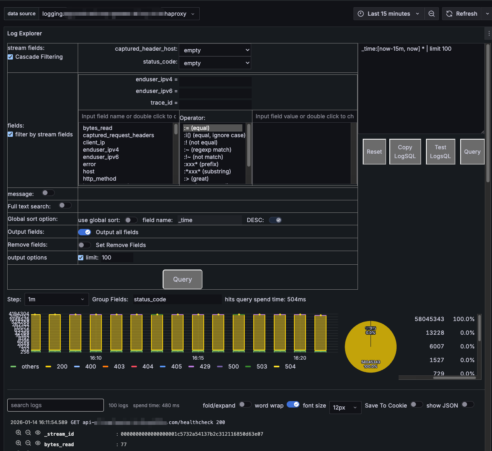

# VictoriaLogsExplorer
A grafana panel for explorer logs on VictoriaLogs.

* VictoriaLogs: https://github.com/VictoriaMetrics/VictoriaLogs
* VictoriaLogs Datasource:
  - https://github.com/VictoriaMetrics/victorialogs-datasource

* intro:
  - [LogFilter Panel: 我做了一个 grafana 中更好用的 VictoriaLogs 日志筛选面板](https://www.cnblogs.com/ahfuzhang/p/19322423) (Chinese)

## How to use

* `make generate`
  - generate template code
* `make patch`
  - only patch modified file to template
* `make diff`
  - after modify, update patch file
* `make generate-by-docker`
  - If you don't want to install nodejs tools
* `make build-by-docker`
* `make docker-run-test`
  - test by "http://127.0.0.1:3001/"
* `make docker-run-test-with-download`
  - show how to download plugin and run in grafana.

## Functions

A all-in-one log explorer.

